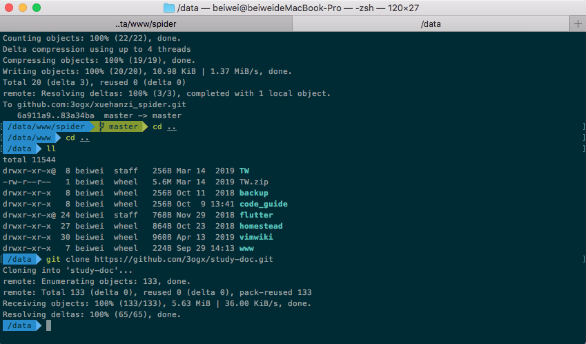
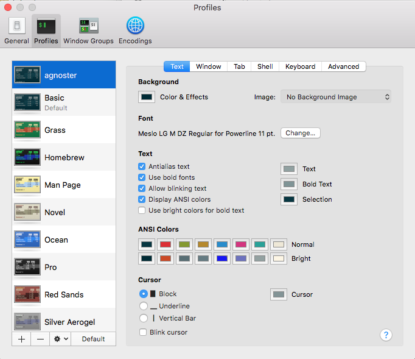

# Mac OS X 下优化 Terminal
先看下效果

## 相关工具介绍
+ iTerm2： Terminal 终端的替代品，拥有更多强大的功能，想了解更多请戳 [官网](https://www.iterm2.com/)；
	+ 其实也可以不用这个工具，习惯了Mac 自带的终端，后面直接导入配置就可以了。
	+ 
+ XCode’s Command line tools: 开发环境集成，包含 git、gcc 等重要工具；
+ zsh：Linux 的一种 shell 外壳，强大的虚拟终端，和 bash 属于同类产品，OS X 已自带；
+ Oh-My-Zsh: 用来管理 zsh 的配置，同时还有很多社区贡献的主题配置以及好用的插件可供使用，了解更多请戳 Oh-My-Zsh [官网](https://ohmyz.sh/)；

## 配置总览
1. iTerm2
2. Oh-My-Zsh
3. agnoster 主题
4. zsh 命令语法高亮

## 安装步骤
1. 安装 iTerm2
2. 安装 XCode’s Command line tools

	在命令行运行 `xcode-select –install`

3. 检查 `zsh` 是否已安装
	
	在命令行运行 `zsh --version`
	
	如果显示 `zsh 5.3 (x86_64-apple-darwin17.0)`
	
	如果没装则需要输入：
	
	`brew install zsh zsh-completions`
4. 安装 Oh-My-Zsh

	可以通过 `curl` 或者 `wget` 来安装
	+ curl
	`sh -c "$(curl -fsSL https://raw.github.com/robbyrussell/oh-my-zsh/master/tools/install.sh)"`
	+ wget
	`sh -c "$(wget https://raw.github.com/robbyrussell/oh-my-zsh/master/tools/install.sh -O -)"`
	
	如果想修改默认 shell 为原来的 bash：
	
	`chsh -s /bin/bash`

5. 安装 [Powerline fonts](https://github.com/powerline/fonts)

	通过 git 安装, 直接执行以下命令行：
	`git clone https://github.com/powerline/fonts.git --depth=1; cd fonts; ./install.sh; cd ..; rm -rf fonts`
	
	然后到 iterm2 配置，设置字体
	1. 打开 **Preferences**，选择 **Profiles**
	2. 选择 **Text**，点击 **Change Font**
	3. 选择固定宽度，选择自己喜欢的字体。注意： iTerm2 可以实时看到效果，结尾不是 for Powerline 的会乱码。
	4. 接着修改字体颜色，选择另一项 **Colors**, 点击 **Color Presets**, 选择 **Solarized Dark**

## 安装配置主题

装好之后就可以换到 agnoster 主题，Oh My Zsh 一般自带有这个主题。

可以看看其它的默认主题	

`ls ~/.oh-my-zsh/themes`
	
需要修改主题只需：

`vim ~/.zshrc`

然后把里面 ZSH_THEME 的值改为 ZSH_THEME="agnoster"，保存退出.

## 修改命令提示符
默认的命令提示符为 **user@userdemackbookPro**，这样的提示符配合 powerlevel9k 主题太过冗长，因此我选择将该冗长的提示符去掉，在 **~/.zshrc** 配置文件后面追加如下内容：

+ 注意：DEFAULT_USER 的值必须要是系统用户名才能生效
`DEFAULT_USER="user"`

> 参考 [Mac OS X 下优化 Terminal，一篇就够了！](https://www.jianshu.com/p/5e06509f4565)
